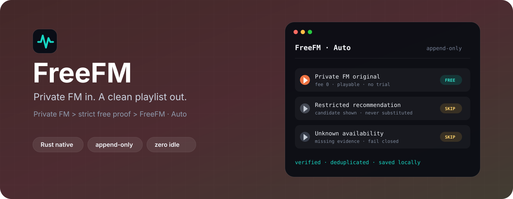
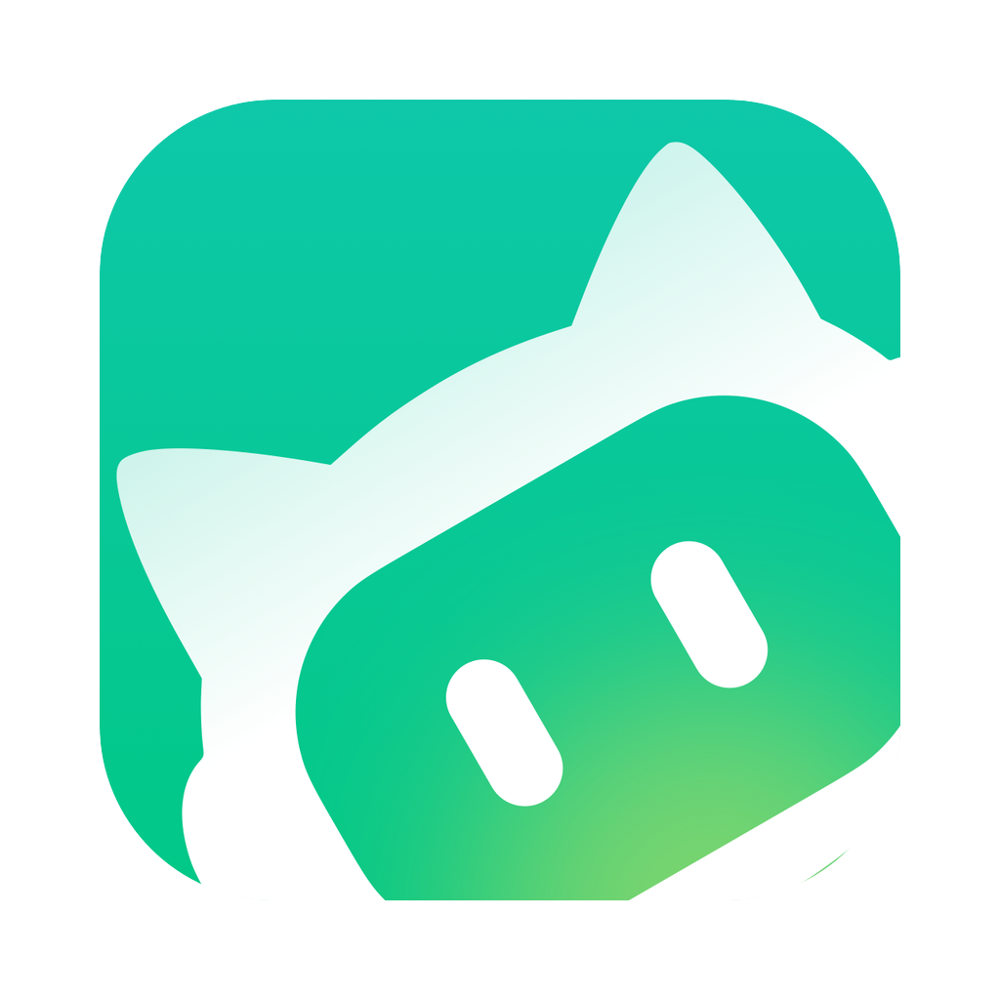

<div align="center">

# 🎧 FreeFM

**私人 FM 进去，一张干净可免费播放的歌单出来。**

原生 Rust CLI/TUI · 安全同步网易云私人 FM 免费原曲，自动追加生成专属歌单

[](https://github.com/Yuxin-Qiao/FreeFM/actions/workflows/ci.yml)
[](https://www.rust-lang.org/)
[](#安装)
[](LICENSE)
[](https://clawhub.ai/yuxin-qiao/skills/freefm)
[](https://www.skills.sh/yuxin-qiao/freefm/freefm)
[](#agent-平台)

[快速开始](#快速开始) · [让 AI 帮你安装](#让-ai-帮你安装) · [TUI](#tui) ·
[Agent 平台](#agent-平台) · [English](README.md)

</div>



> [!IMPORTANT]
> 独立社区项目，非网易云官方产品；不破解 VIP、不替换播放地址、不下载音频，
> 只操作自己的账号。接口未公开，可能随时变化。

## 这是什么

FreeFM 读取网易云私人 FM，只把**普通账号有明确正证据可免费完整播放**的原曲追加到
你拥有的 `FreeFM · Auto` 歌单：

- **严格正证据**：字段缺失、格式异常或互相矛盾一律跳过；相似免费发行绝不自动替换，
  `preview` 只展示为候选，`freefm review` 可让你一次性确认 trusted mapping。
- **长期可播**：`freefm audit` 用与加入时相同的严格逻辑复查歌单里每首歌
  （`still_free` / `became_restricted` / `unavailable` / `unknown`），绝不修改歌单；
  v0.1 不做自动修复。
- **只追加**：`preview` 永远只读，只有 `sync` 写歌单；重复/并发按 ID 去重，不删除、
  不重排、不碰手工加入的歌曲。
- **零常驻**：单次执行后立即退出，空闲时 0 进程、0 RAM、0 CPU，无数据库、无 Web
  服务、无 LLM。

## 三大核心原则

1. **不破解 VIP**：绝不破解 VIP/受限歌曲、不替换播放地址、不绕过 DRM、不下载音频。
2. **无常驻后台**：单次执行、用完即退出。0 常驻进程、空闲时 0 RAM 0 CPU。
3. **定时同步零 LLM**：定时任务直接运行确定性 CLI 命令 `freefm sync --quiet`，**消耗 0 个 LLM token**。

## 快速开始

### 1. 一键安装预编译二进制（macOS / Linux）

```sh
curl -fsSL https://raw.githubusercontent.com/Yuxin-Qiao/FreeFM/main/scripts/install.sh | sh
```

*(Rust 开发者亦可使用：`cargo install --git https://github.com/Yuxin-Qiao/FreeFM --locked`)*

### 2. 使用 FreeFM

```sh
freefm auth          # 用网易云官方客户端扫码登录
freefm preview       # 只读预览：展示将加入 / 候选 / 跳过
freefm preview --max-additions 10 # 可选：限制本次最多计划加入 10 首
freefm audit         # 只读复查：已保存歌曲现在是否仍可免费播放（exit 3 = 需要关注）
freefm review        # 交互式：人工确认一次免费同曲候选（仅本机记录）
freefm sync          # 只追加写入到 "FreeFM · Auto" 歌单
freefm sync --max-additions 10 # 可选硬上限；不传参数仍保持不限制
freefm sync --quiet  # 定时任务路径；成功时无输出

# 终端交互界面：
freefm tui
```

凭证只保存在 `~/.freefm/`，不写日志、不上传；不要把 Cookie、`MUSIC_U`、session 或
二维码 key 发给任何人或 AI。

### 导入 Spotify、Apple Music、YouTube Music 歌单

`--source` 通过各平台官方元数据接口读取歌单，并沿用现有安全边界：
`preview` 只读；导入到网易云的跨平台映射只有 `review` 的人工确认才能信任，普通的
source→网易云 `sync` 只追加已经确认、且当前已被网易云严格证明可免费播放的目标歌曲。
带 `--target` 的同平台同步直接使用来源稳定曲目 id，不搜索或替代录音。

```sh
# Spotify Web API OAuth access token
export FREEFM_SPOTIFY_TOKEN='...'
# 对没有用户国家信息的 token，可选设置 ISO-3166-1 alpha-2 market
export FREEFM_SPOTIFY_MARKET='US'
freefm preview --source 'https://open.spotify.com/playlist/<id>'
freefm review  --source 'https://open.spotify.com/playlist/<id>'
freefm sync    --source 'https://open.spotify.com/playlist/<id>'

# 同平台追加复制：先校验目标歌单归属，再按稳定曲目 id 幂等追加
freefm sync --source 'https://open.spotify.com/playlist/<source-id>' \
  --target 'https://open.spotify.com/playlist/<target-id>'

# Apple Music catalog 歌单：developer token
export FREEFM_APPLE_MUSIC_DEVELOPER_TOKEN='...'
freefm preview --source 'https://music.apple.com/us/playlist/<name>/pl.<id>'

# Apple Music 资料库歌单：developer token + Music User Token
export FREEFM_APPLE_MUSIC_USER_TOKEN='...'
freefm preview --source 'https://music.apple.com/us/library/playlist/<id>'

# 公开 YouTube / YouTube Music 歌单：Data API key
export FREEFM_YOUTUBE_API_KEY='...'
freefm preview --source 'https://music.youtube.com/playlist?list=<id>'
# 私有歌单可改用 OAuth access token，不必设置 API key：
export FREEFM_YOUTUBE_ACCESS_TOKEN='...'

# Apple Music 目标必须是资料库歌单；YouTube 目标必须使用 OAuth
freefm sync --source 'https://music.apple.com/us/playlist/<name>/pl.<source-id>' \
  --target 'https://music.apple.com/us/library/playlist/<target-id>'
freefm sync --source 'https://music.youtube.com/playlist?list=<source-id>' \
  --target 'https://music.youtube.com/playlist?list=<target-id>'

# 跨平台迁移：逐首搜索候选、人工选择并确认；review 不写远端歌单
freefm review --source 'https://open.spotify.com/playlist/<source-id>' \
  --target 'https://music.youtube.com/playlist?list=<target-id>'

# TUI 也可传入同一来源，选中的操作会沿用它
freefm tui --source 'https://open.spotify.com/playlist/<id>'

# 只读检查 URL 解析和所需环境变量是否已配置
freefm doctor --json --source 'https://open.spotify.com/playlist/<id>'
# 只读检查目标凭证和权限；不请求平台、不写远端
freefm doctor --json --target 'https://music.youtube.com/playlist?list=<target-id>'
```

外部平台凭证只从环境变量读取、只在本次运行使用，绝不写入 `~/.freefm/`；本地文件只保存
明确确认的 mapping 和网易云同步状态。平台不支持的项目、不可用视频和元数据不完整的项目会计数
并跳过；FreeFM 不下载音频，也不会自动替换录音。
`sync --source --target` 只支持同一平台的稳定曲目 id 复制，会先读取目标歌单并按远端 id
去重，再分批追加。跨平台必须先运行 `review --source --target`，搜索结果只作为候选，逐首明确确认后
才会保存映射；没有完整映射时 `sync` 返回 `target_mapping_required` 并拒绝写入，不会静默替换录音。

FreeFM 不内置 Spotify、Apple Music 或 YouTube 的 OAuth 登录/刷新和 token 持久化：
这些流程需要各平台自己的应用注册、回调和密钥管理，内置会扩大本地凭证面。请在平台官方
OAuth 流程中取得短期 token，只为本次命令导出环境变量，并用 `doctor --target` 查看所需
权限。token 缺失或过期会在写入前 fail-closed。每个追加批次写入后都会复读目标归属和曲目；
若复读无法确认追加结果，返回 `target_write_uncertain`，不会自动重试。

### 让 AI 帮你安装

把下面整段交给能操作终端的 AI：

```text
请在这台 macOS 或 Linux 电脑安装 FreeFM：
https://github.com/Yuxin-Qiao/FreeFM

先阅读 AGENTS.md 和 README.zh-CN.md。禁止索取、读取、打印或上传网易云 Cookie、
MUSIC_U、session 和二维码 key。使用
`curl -fsSL https://raw.githubusercontent.com/Yuxin-Qiao/FreeFM/main/scripts/install.sh | sh` 安装。
让我本人在可见终端运行 `freefm auth` 并扫码。先运行 `freefm preview`；未经我确认，
不要运行 sync 或修改定时任务。定时同步必须直接执行 `freefm sync --quiet`，不能
启动 Agent/LLM。遇到权限、登录或接口错误时只给脱敏提示，不要改 DNS、VPN、代理。
```

## TUI

`freefm tui` 是原生 Rust 终端菜单：登录、预览、人工确认、审计、同步、状态、诊断和**设置**。
人工确认和审计会退出菜单后调用现有 CLI 实现；两者都不会写入远端歌单。
方向键或 `j`/`k` 选择，`o` 切换 JSON 输出，`q` 退出；设置页可切换静默模式（`u`），
适合定时任务的偏好。同步必须明确按 `y`，Enter 默认取消。自动化固定使用
`freefm sync --quiet`，不使用 TUI。

## 命令

| 命令 | 远端写入 | 用途 |
|---|---:|---|
| `freefm auth` | 否 | 官方客户端扫码登录 |
| `freefm preview` | 否 | 展示加入、候选和跳过 |
| `freefm audit` | 否 | 复查已保存歌曲：still_free / became_restricted / unavailable / unknown |
| `freefm review` | 仅本机 | 从最多三个严格候选中人工确认一个 trusted 免费版本；绝不写远端 |
| `freefm sync` | 只追加 | 加入严格验证的免费原曲 |
| `freefm status` | 否 | 检查 session、账号与本地同步统计 |
| `freefm doctor` | 否 | 检查权限、状态和接口结构 |
| `freefm tui` | 取决于选择 | 上述命令的交互入口 |

`--json` 提供稳定机器输出，`--quiet` 成功时静默；`--data-dir PATH` 或
`FREEFM_HOME` 可隔离状态目录。

### JSON Contract v1

机器可读成功结果包含 `schema_version: 1`、`ok: true` 和 `command`；错误结果
包含同一 schema 版本及稳定的 `error.kind`。既有字段不会删除，新增字段允许出现，
客户端应忽略未知字段。sync 保留兼容字段 `would_add_ids`，只有远端复读确认后才
填充 `added_ids` / `added_count`。

## Agent 平台

产品永远是 Rust 二进制；Skill 只负责安装和确定性调用。正常定时同步
**0 LLM token**。

公开技能条目：[ClawHub](https://clawhub.ai/yuxin-qiao/skills/freefm) ·
[skills.sh](https://www.skills.sh/yuxin-qiao/freefm/freefm)

| Logo | 平台 | 安装方法 | 无模型定时路径 (0 Token) |
| :---: | :--- | :--- | :--- |
|  | **OpenClaw** | `openclaw skills install @yuxin-qiao/freefm` | Gateway `--command-argv` |
|  | **Hermes** | `hermes skills install Yuxin-Qiao/FreeFM/skills/freefm` | `--no-agent` 脚本路径 |
|  | **WorkBuddy** | 上传 `freefm-workbuddy.zip` | 本地 Command 能力 |
|  | **Codex** | 复制至 `~/.codex/skills/freefm` | 系统 cron / `codex sandbox` |

OpenClaw 定时示例：

```sh
openclaw automations add --every 6h --name freefm-sync \
  --command-argv '["/absolute/path/to/freefm","sync","--quiet"]' \
  --no-deliver --timeout-seconds 120
```

保守默认是每 6 小时一次，避免歌单过快膨胀；FreeFM 本身不内置 scheduler，你可以
按需提高或降低频率。

再配一个低频只读 audit 任务，历史歌曲变 VIP/不可用时无需你记得手动复查：

```sh
openclaw automations add --every 24h --name freefm-audit \
  --command-argv '["/absolute/path/to/freefm","audit","--quiet"]' \
  --no-deliver --timeout-seconds 120
```

`audit --quiet` 健康时静默，需要关注时以结构化输出和 exit 3 提示（变成受限、
不可用或状态未知），且绝不修改歌单。

WorkBuddy 包：`scripts/package-workbuddy.sh` 生成
`target/freefm-workbuddy.zip`，在“专家·技能·连接器 → 添加技能 → 上传技能”导入。
长期验证门槛完成前不要开启无人值守同步。

Codex：`skills/freefm` 目录本身即 Codex skill（`name`/`description` frontmatter），
安装后重启 Codex。注意 `codex exec` 和桌面端循环自动化会启动 Agent 回合（消耗
token），只用于安装与诊断；零 token 周期同步仍由系统 cron/launchd 直接执行
`freefm sync --quiet`，或经 `codex sandbox` 确定性运行（需允许网络与
`~/.freefm` 写入的 permissions profile）。详见
[`automation/codex/README.md`](automation/codex/README.md)。

平台标志仅用于指代对应产品，均为各自所有者的商标；此处以 nominative use 方式
展示，不代表任何官方关联或背书。

## 安全边界

只接受明确 `vipType == 0`；privilege 与播放能力信息同时证明 fee 为数值 0、可播放、
URL 非空、无免费试用标记，URL 不打印不持久化。多个本人同名歌单 fail-closed；本地
锁防止并发创建和追加。错误码：`login_required` 重新 `auth`；
`ordinary_account_required` 账号不满足条件；`api_incompatible` 接口变化，暂停
定时任务并提交脱敏 Issue；`concurrent_sync` 已有任务在跑。

## 验证与文档

真实接口、被动 FM 实验、session 重启、请求数、二进制大小/峰值 RSS、平台实跑与剩余
限制见 [V01-VALIDATION.md](V01-VALIDATION.md)。开发规范见 [AGENTS.md](AGENTS.md)、
[CONTRIBUTING.md](CONTRIBUTING.md)、[SECURITY.md](SECURITY.md)。

<div align="center">

**少做一点，但每一步都能解释、能复现、能安全退出。** · [MIT License](LICENSE)

</div>
